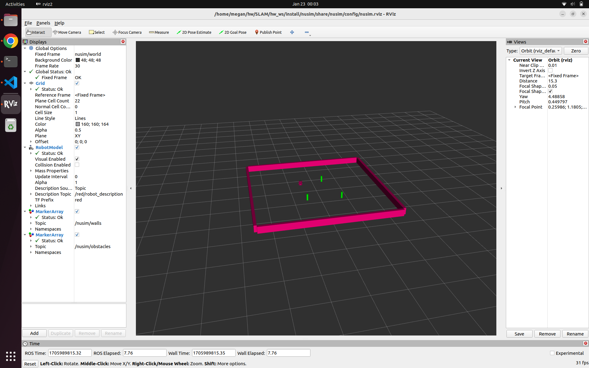

# NUSIM
* Megan Black
* ME495 Sensing, Navigation and Machine Learning For Robotics
* Winter 2024

## Description
This package provides a simulation environment for the Turtlebot3 robot.


## Usage Instructions
1. Use `ros2 launch nusim nusim.launch.xml` to start the arena and simulation environment
2. Use `ros2 service call /nusim/teleport nusim/srv/Teleport "{x: -0.5, y: 0.7, theta: 1.28}"` to teleport the robot to a location
3. Use `ros2 service call /nusim/reset std_srvs/srv/Empty "{}"` to reset tthe simulation environment




## Launchfile 
The `nusim.launch.xml` launchfile accepts a custom .yaml parameter file as the `config_file` argument.  The default for `config_file` is `config/basic_world.yaml`. 

To use a custom parameter file, launch the simulation environment with `ros2 launch nusim nusim.launch.xml config:=config/parameters.yaml` where `config/parameters.yaml` is the location/name of your file (relative to the package share folder).

## Configuration Instructions

### Parameters
The `rate` parameter changes the main timer frequency and defaults to 200 Hz.

The `x0`, `y0`, and `theta0` parameters change the starting position of the robot and default to (0.0m, 0.0m, 0.0rad).

The `arena_x_length` and `arena_y_length` parameters change the arena size and default to 5m by 5m.

The `obstacles/x` and `obstacles/y` parameters define the existence and location of obstacles and default to empty vectors.  If `obstacles/x` and `obstacles/y` are vectors of different lengths, the nusim_node will shutdown.

The `obstacles/r` parameter changes the radius of all obstances and defaults to 0.25m.

Parameters can be set in a configuration file as explained above.  The `config/basic_world.yaml` file sets the parameters:
```
    rate: 200.0
    x0: -0.5
    y0: 0.7
    theta0: 1.28
    arena_x_length: 5.0
    arena_y_length: 5.0
    obstacles/x: [-0.5, 0.8, 0.4]
    obstacles/y: [-0.7, -0.8, 0.8]
    obstacles/r: 0.038
```

### Publishers
The nusim_node publishes the current timestep to the `/nusim/timestep` topic.  The timestep is published in miliseconds.

On startup, the nusim_node publishes the arena and obstacles to the `/nusim/walls` and `/nusim/obstacles` topics.


### Services
The `/nusim/teleport` service can be called to change the location of the robot.  The `/nusim/teleport` service is of type `nusim/srv/Teleport` and accepts this prototype:
   ```
   "x:
   y:
   theta: 
   "
   ```
The `/nusim/teleport` service responds with an empty message.

The `/nusim/reset` service resets the simulation environment.  The `/nusim/reset` service is of type `std_srvs/srv/Empty` and returns and empty response.
           