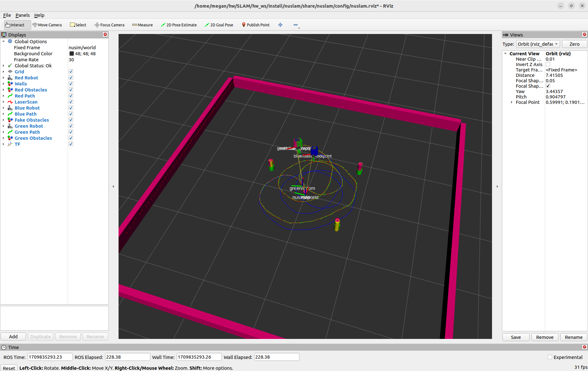

# NUSLAM
* Megan Black
* ME495 Sensing, Navigation and Machine Learning For Robotics
* Winter 2024

## Description
This package provides a slam implementation for the turtlebot3.

## Usage Instructions
1. Use `ros2 launch nuslam unknown_data_assoc.launch.xml` to start the arena and simulation environment
2. Instead, you can run this project on a real robot.  Use `ros2 launch nuslam turtlebot_bringup.launch.xml` to start the nodes on the real robot.  Use `ros2 launch nuslam pc_bringup.launch.xml` to start the nodes on your computer.
3. Use `ros2 service call /control nuturtle_control/srv/Control "{velocity: 0.1, radius: 0.5}"` to control the robot to move in a circle

### Real robot with unknown data association:

[SLAM_real_robot.webm](https://github.com/ME495-Navigation/slam-project-blackm159/assets/116540591/ead5332e-18cd-4497-851a-34eecb968686)

[SLAM_real.webm](https://github.com/ME495-Navigation/slam-project-blackm159/assets/116540591/45c100a0-c512-4d88-bc22-9bd54964be4c)

The final pose error between the actual robot (red) and odometry (blue) is [0.235, -0.013] m and -0.104 rad.  The final pose error between the actual robot (red) and the estimated robot (green) is [0.113, 0.010] m and -0.034 rad.

### Robot with unknown data association in RViz:

[SLAM_unknown_data_assoc.webm](https://github.com/ME495-Navigation/slam-project-blackm159/assets/116540591/3714522b-6e7b-4b87-8d56-bd5664c8c15f)

The final pose error between the actual robot (red) and odometry (blue) is [0.121, -0.114] m and 0.392 rad.  The final pose error between the actual robot (red) and the estimated robot (green) is [0.027, 0.029] m and 0.04 rad.

### Robot with known data association in RViz:

## Configuration Instructions

### Publishers
The nuslam_node publishes the path the green robot follows to the `green/path` topic. The path is published as a `nav_msgs/msg/Path` message.

The nuslam_node publishes the green obstacles to the `green/obstacles` topic. The obstacles are published as a `visualization_msgs/msg/MarkerArray` message.

The landmarks_node publishes the landmarks to the `landmarks` topic. The landmarks are published as a `visualization_msgs/msg/MarkerArray` message.

### Subscribers
The nuslam_node subscribes to the `odom` topic to get the position of the blue robot due to odometry calculations. The position is published as a `nav_msgs/msg/Odometry` message.

The nuslam_node subscribes to the `/landmarks` topic to get the locations of obstacles in the environment. The obstacles are published as a `visualization_msgs/msg/MarkerArray` message.

The landmarks_node subscribes to the `scan` topic to get the lidar data. The lidar data is published as a `sensor_msgs/msg/LaserScan` message.