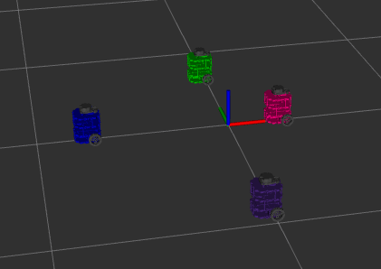

# Nuturtle  Description
URDF files for Nuturtle Teenage Mutant Ninja Turtle
* `ros2 launch nuturtle_description load_one.launch.py` to see the robot in rviz.
* `ros2 launch nuturtle_description load_all.launch.xml` to see four copies of the robot in rviz.

* The rqt_graph when all four robots are visualized (Nodes Only, Hide Debug) is:

# Launch File Details
* `ros2 launch nuturtle_description load_one.launch.py --show-args`

  ```
  Arguments (pass arguments as '<name>:=<value>'):

    'use_rviz':
        launch rviz2
        (default: 'true')

    'use_jsp':
        launch joint_state_publisher
        (default: 'true')

    'color':
        color of turtlebot3. Valid choices are: ['red', 'green', 'blue', 'purple']
        (default: 'purple')
    ```

* `ros2 launch nuturtle_description load_all.launch.xml --show-args`

  ```
  Arguments (pass arguments as '<name>:=<value>'):

    'use_rviz':
        launch rviz2
        (default: 'true')

    'use_jsp':
        launch joint_state_publisher
        (default: 'true')

    'color':
        color of turtlebot3. Valid choices are: ['red', 'green', 'blue', 'purple']
        (default: 'purple')

    ```